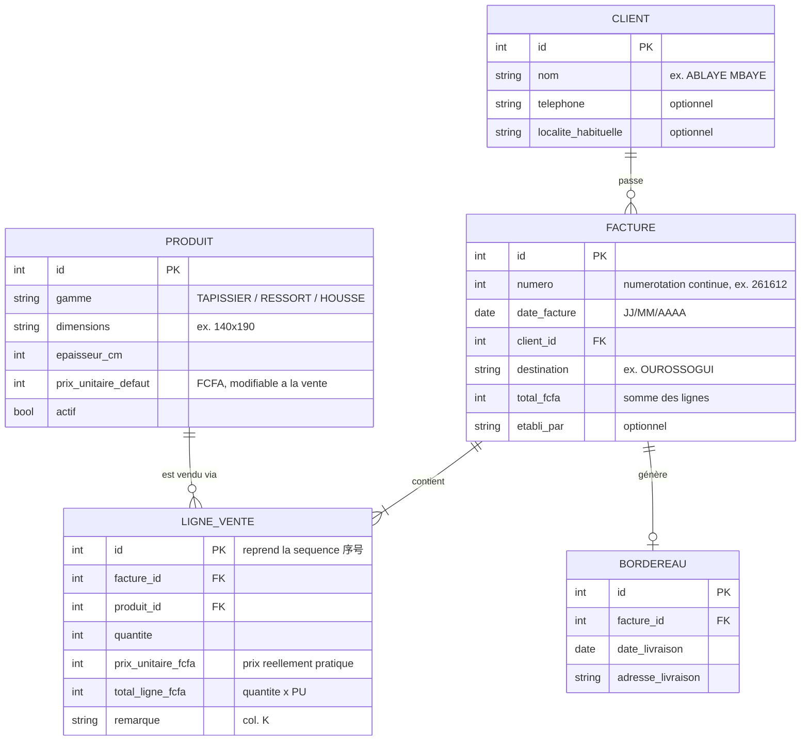

# Analyse des fichiers Excel existants — PRO-MATELAS

> Phase 1 du projet de migration vers une application desktop Python (Tkinter).
> Fichiers analysés le 18/07/2026 :
> - `facture.xlsm` (classeur à macros — facturation + historique des ventes)
> - `BORDEREAU DE LIVRAISON - 副本(1).xlsx` (bordereau de livraison)
> - `logo.png` (logo « SM » avec éléphant, en-tête des documents)

---

## 1. Contexte métier

L'entreprise **PRO-MATELAS** (Diamniadio, route de Thiès, avant l'hôpital des enfants — Sénégal) vend des **matelas** (tapissier, ressort, housse) en différentes dimensions et épaisseurs. Identifiants légaux figurant sur les documents :

- **NINEA** : 010393859
- **RC** : SN.DKR.2023.B.26235
- **Téléphones** : 77 694 11 70 / 78 501 66 66 / 77 172 08 08

Le classeur a été construit avec des libellés techniques en **chinois** (feuilles, macros, en-têtes de la base) mais l'interface visible de la facture est en français. Devise : **FCFA** (aucun symbole dans les cellules, format milliers `#,##0`).

---

## 2. `facture.xlsm`

### 2.1 Feuille `销售录入` (« Saisie des ventes ») — masque de facture

Rôle : écran de saisie et modèle d'impression de la facture client.

| Zone | Cellules | Contenu | Remarques |
|---|---|---|---|
| En-tête société | `C1:F2` (fusion) | Raison sociale, adresse, téléphones, NINEA, RC | + logo image |
| Date | `H1` | `=TODAY()` — format `mm-dd-yy` | La date affichée est donc toujours « aujourd'hui » |
| N° de facture | `H3` | Nombre, ex. `261612` | Écrit par la macro `Update` |
| Destination | `C4` (saisie), libellé `B4` | Ville/localité de livraison | ex. « OUROSSOGUI » |
| Client | `C5` (saisie), libellé `B5` « Mr: » | Nom du client | Texte libre, pas de fichier clients |
| Cellules techniques | `K1` (« date courante »), `K2` (« compteur courant » = 3) | Résidus d'usage, non exploités par les macros | |

**Tableau des lignes de facture** (lignes 8 à 39, soit 32 lignes max) :

| Colonne | En-tête (ligne 7) | Type | Rôle |
|---|---|---|---|
| `A` | (n° ligne 1–31, 34) | texte | Numérotation visuelle figée |
| `B` | QUANTITE | nombre (format texte `@` !) | Quantité vendue — **cellule non vide = ligne active** (condition d'arrêt de la macro) |
| `C:D` | DESIGNATION | texte | Nom du produit, ex. « SM TAPISSIER 140X190X » |
| `E:F` | EPAISSEUR | nombre | Épaisseur en cm (5, 7, 9, 11, 17, 18, 20, 30…) |
| `G` | P.Unitaire | nombre | Prix unitaire FCFA |
| `H` | P.Total | **formule `=G{r}*B{r}`** | Total de ligne, format `#,##0` |

**Total facture** : `H40 = SUM(H8:H39)`.

> ⚠️ **Aucune TVA, aucune remise, aucun acompte** dans le classeur : le total est la simple somme des lignes. Les prix saisis sont donc traités comme définitifs (TTC ou hors taxe selon le régime de l'entreprise — à confirmer).

### 2.2 Feuille `数据库` (« Base de données ») — historique des ventes

Rôle : journal de **toutes les lignes de vente** (une ligne Excel = une ligne de facture, pas une facture).

| Col. | En-tête (chinois) | Traduction | Exemple |
|---|---|---|---|
| `A` | 序号 | N° séquentiel de ligne | 5445 |
| `B` | 客户名称 | Nom du client | ABLAYE MBAYE |
| `C` | 日期 | Date | 18/07/2026 |
| `D` | 单号 | N° de facture | 261611 |
| `E` | 地址 | Destination / adresse | OUROSSOGUI |
| `F` | 名称 | Désignation produit | SM TAPISSIER 90X190X |
| `G` | 厚度 | Épaisseur (cm) | 9 |
| `H` | 数量 | Quantité | 10 |
| `I` | 单价 | Prix unitaire (FCFA) | 14 130 |
| `J` | 合计 | Total ligne (FCFA) | 141 300 |
| `K` | 备注 | Remarque | (vide) |
| `L` | 制单人 | Établi par | (vide) |

**État des données dans la copie fournie :**

- **16 lignes seulement** (n° 5445 → 5459), toutes datées du **18/07/2026**, toutes pour la facture **261611** (client ABLAYE MBAYE, OUROSSOGUI, total 6 628 670 FCFA).
- Le compteur à 5445 prouve qu'environ **5 444 lignes historiques existent ailleurs** : cette copie du fichier a été purgée ou est un fichier « neuf ». ⚠️ **L'historique complet devra être fourni pour la migration.**
- Colonnes `K` (remarque) et `L` (établi par) jamais renseignées dans l'échantillon.

### 2.3 Macros VBA (module `模块1`) — logique métier

Deux procédures, qui définissent le **cycle de vie d'une facture** :

**`CopyDataValues` — « Enregistrer la facture »**
1. Lit le dernier n° de facture enregistré dans la base (`D` de la dernière ligne).
2. **Garde-fou anti-doublon** : si ce n° == n° de la facture en cours (`H3`), message « commande déjà ajoutée » et abandon.
3. Sinon, pour chaque ligne de saisie tant que `B{i}` (quantité) est non vide (à partir de la ligne 8) : ajoute une ligne à la base avec : n° séquentiel, client (`C5`), date (`H1`), n° facture (`H3`), destination (`C4`), désignation (`C{i}`), épaisseur (`E{i}`), quantité (`B{i}`), P.U. (`G{i}`), total (`H{i}`).

**`Update` — « Nouvelle facture »**
1. Lit le dernier n° de facture de la base.
2. **Numérotation `AANNNN`** (2 chiffres d'année + séquence) :
   - si les 2 premiers chiffres du dernier n° == année en cours sur 2 chiffres → `n° suivant = dernier + 1` (ex. 261611 → 261612) ;
   - sinon (changement d'année) → repart à `AA0001` (ex. premier n° de 2027 = `270001`) ;
   - si la base est vide → `AA0000`.
3. Vide le formulaire : client, destination, plage `B8:G37`.

> ⚠️ Incohérences relevées : la remise à zéro efface `B8:G37` alors que le tableau va jusqu'à la ligne 39 ; le n° séquentiel colonne A est décalé de 1 par rapport au n° de ligne réel (sans conséquence métier). La macro de changement d'année incrémente le préfixe du **dernier n°** au lieu de prendre l'année réelle (bug latent si une année entière sans vente). **Décision ultérieure** : l'application Python a d'abord repris le schéma `AANNNN` tel quel, puis l'a abandonné au profit d'une numérotation **continue** (`max(numéros connus) + 1`, sans remise à zéro ni plafond annuel) — le plafond de 9999 factures/an du schéma Excel pouvait bloquer la facturation avant la fin de l'année en cas de volume soutenu. Voir CLAUDE.md, « Règles métier clés ».

---

## 3. `BORDEREAU DE LIVRAISON - 副本(1).xlsx`

Une seule feuille (`Sheet1`), **document purement manuel** : aucune formule, aucune macro, aucun lien avec `facture.xlsm`. C'est le document que le livreur doit présenter en cas de contrôle.

Structure :

| Zone | Cellules | Contenu |
|---|---|---|
| En-tête société | `C2:C8` | Mêmes mentions que la facture (+ logo) |
| Titre | `D10` | « BORDEREAU DE LIVRAISON » |
| Adresse | `C11` | Destination (ex. « BAKEL ») |
| Date | `E11` | Saisie en texte libre (« DATE :16/07/26 ») |
| Client | `B12` | Nom du client |
| Tableau | lignes 14–42 | Colonnes **QUANTITE / DESIGNATION / EPAISSEUR** — **sans prix** |

Règle métier déduite : le bordereau reprend les lignes de la facture **sans les montants** (document de transport). Il est aujourd'hui re-saisi à la main — l'application le générera automatiquement depuis la facture.

---

## 4. Catalogue produits observé

Aucune table de référence produits n'existe : la désignation est saisie librement. L'échantillon montre une convention `SM <GAMME> <LARGEURxLONGUEUR>X` + épaisseur séparée :

| Gamme | Dimensions vues | Épaisseurs vues (cm) | P.U. observés (FCFA) |
|---|---|---|---|
| SM TAPISSIER | 90×190, 140×190, 180×190 | 7, 9, 11, 17, 18, 20 | 10 990 → 62 800 |
| SM RESSORT | 180×190 | 30 | 78 000 |
| SM HOUSSE | 140×190 | 5, 7, 9, 11 | 7 750 → 17 050 |

Le prix dépend du triplet (gamme, dimensions, épaisseur) ; il varie potentiellement par client/négociation puisqu'il est ressaisi à chaque facture.

---

## 5. Modèle de données métier proposé

### Règles de gestion à reproduire

1. **Total ligne** = quantité × prix unitaire ; **total facture** = somme des lignes. Pas de TVA ni de remise (V1, à confirmer).
2. **Numérotation facture** : d'abord reprise du schéma Excel `AANNNN`, puis remplacée par une numérotation **continue** (`max(numéros connus) + 1`, jamais de remise à zéro ni de plafond annuel — voir note plus haut).
3. **Anti-doublon** : une facture ne peut être enregistrée deux fois sous le même numéro.
4. Une ligne de vente n'est valide que si sa **quantité est renseignée et > 0**.
5. Le **bordereau de livraison** = lignes de la facture sans les prix (quantité, désignation, épaisseur) + destination, client, date.
6. Montants **FCFA entiers**, affichés avec séparateur de milliers ; dates affichées **JJ/MM/AAAA**.
7. La **séquence des lignes** (序号) reprendra à la suite de l'existant (≥ 5460) pour la traçabilité.

---

## 6. Anomalies et risques identifiés

| # | Constat | Impact / traitement prévu |
|---|---|---|
| 1 | **Historique tronqué** : seulement 16 lignes (5445–5459) dans la copie fournie | Migration incomplète — demander le fichier complet |
| 2 | Quantité (`B8:B39`) au **format texte** dans le masque | Le script d'import convertira et validera les types |
| 3 | Date de facture = `TODAY()` : les factures réimprimées changent de date | L'application stockera une date figée par facture |
| 4 | Pas de référentiel clients ni produits (texte libre → risque de doublons « ABLAYE MBAYE » / « ABLAYE  MBAYE ») | Normalisation à l'import + tables Client / Produit |
| 5 | Désignations tronquées « …X » sans l'épaisseur (colonne séparée) | Reconstruction du libellé complet à l'import |
| 6 | Bug latent VBA du changement d'année ; effacement `B8:G37` vs tableau jusqu'à 39 | Réécrit proprement en Python |
| 7 | Bordereau entièrement manuel, non relié à la facture | Génération automatique depuis la facture |
| 8 | Colonnes 备注 (remarque) et 制单人 (établi par) inutilisées | Conservées en champs optionnels |

---

## 7. Décisions validées par le propriétaire (18/07/2026)

1. **Historique** : le fichier fourni n'est qu'un extrait. L'application intégrera une fonctionnalité d'**import à la demande** : l'utilisateur fournit le `facture.xlsm` complet en entrée et l'application intègre automatiquement tout l'historique (import idempotent, ré-exécutable).
2. **Langues** : l'interface doit être commutable **français / anglais / chinois**.
3. **TVA / remises** : pas de TVA ni de remise sur les factures. En revanche, une page dédiée permet de **calculer en fin d'année la remise de chaque client** (à partir de son chiffre d'affaires annuel).
4. **Clients et sous-clients** : une page permet d'enregistrer les clients **et les clients des clients** (revendeurs → sous-clients).
5. **Bordereau de livraison** : généré **à la demande** uniquement (certains clients emportent eux-mêmes la marchandise).
6. **Numérotation** : numérotation continue (`max(numéros connus) + 1`, sans remise à zéro ni plafond annuel — voir CLAUDE.md), reprise à 261612 sur la base des numéros `AANNNN` déjà en place. Un numéro = une facture ; les lignes partageant un numéro appartiennent à la même facture. Le numéro s'incrémente automatiquement **mais reste modifiable** : un revendeur peut avoir deux versions d'une facture sous le même numéro (prix entreprise / prix de revente).
7. **Cycle de facturation** : enregistrer et imprimer ne vident PAS le panier. Seul le bouton **« Nouvelle facture »** vide le panier et incrémente le numéro — ce qui permet de modifier les prix et réimprimer sous le même numéro.
